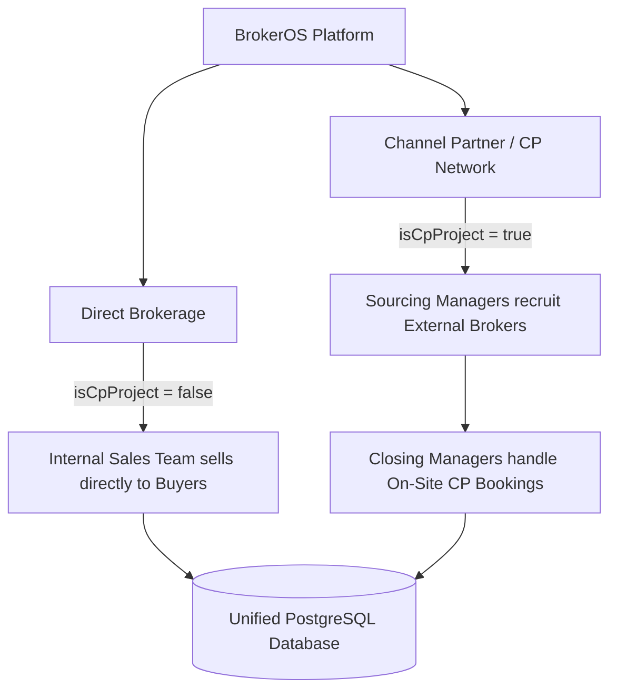
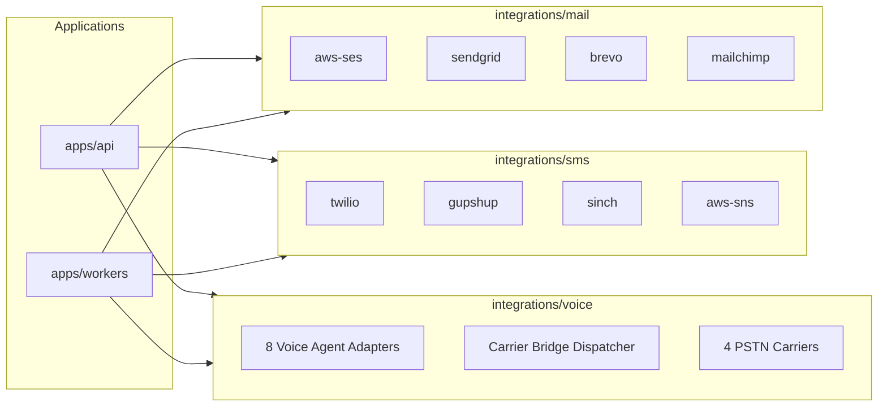
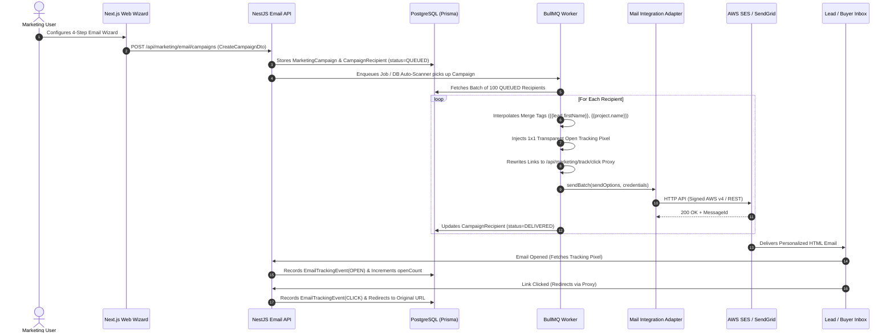

# 🏢 BrokerOS — Complete Codebase & Integrations Architecture Guide

> **Authoritative Technical Reference** for Developers, System Architects, and Autonomous AI Agents.
> Covers Monorepo Architecture, Data Layer, Shared Packages, Integrations, Backend API, BullMQ Workers, Web Frontend, Android Mobile App, and a **Comprehensive Deep Dive into the Email Integration Architecture**.

---

## Table of Contents

1. [Executive Summary & System Invariants](#1-executive-summary--system-invariants)
2. [Complete Monorepo Directory Tree](#2-complete-monorepo-directory-tree)
3. [The Human & Role-Based Access Control (RBAC) Layer](#3-the-human--role-based-access-control-rbac-layer)
4. [Data & Database Layer (Prisma 7 & PostgreSQL)](#4-data--database-layer-prisma-7--postgresql)
5. [Shared Packages Architecture (`packages/`)](#5-shared-packages-architecture-packages)
6. [Integrations Layer (`integrations/`)](#6-integrations-layer-integrations)
7. [Email Marketing Integration — Exhaustive Deep Dive](#7-email-marketing-integration--exhaustive-deep-dive)
   - 7.1 [Shared TypeScript Types (`@brokeros/types`)](#71-shared-typescript-types-brokerostypes)
   - 7.2 [Shared Constants & Catalog (`@brokeros/constants`)](#72-shared-constants--catalog-brokerosconstants)
   - 7.3 [Prisma Data Models & Schema](#73-prisma-data-models--schema)
   - 7.4 [Mail Adapters (`integrations/mail/*`)](#74-mail-adapters-integrationsmail)
   - 7.5 [Backend API Architecture (`apps/api/src/marketing/email/`)](#75-backend-api-architecture-appsapisrcmarketingemail)
   - 7.6 [BullMQ Background Worker (`apps/workers/src/processors/marketing-email.processor.ts`)](#76-bullmq-background-worker)
   - 7.7 [Frontend Web UI & 4-Step Campaign Wizard (`apps/web/features/marketing/email/`)](#77-frontend-web-ui--4-step-campaign-wizard)
   - 7.8 [End-to-End Email Dispatch & Tracking Lifecycle](#78-end-to-end-email-dispatch--tracking-lifecycle)
8. [SMS Marketing Architecture](#8-sms-marketing-architecture)
9. [AI Voice Marketing & Carrier Bridge Architecture](#9-ai-voice-marketing--carrier-bridge-architecture)
10. [Lead Lifecycle, Inventory & Channel Partner (CP) Operations](#10-lead-lifecycle-inventory--channel-partner-cp-operations)
11. [Android Native Auto-Dialer & Mobile Architecture (`apps/mobile/`)](#11-android-native-auto-dialer--mobile-architecture-appsmobile)
12. [Environment Configuration & Split Architecture](#12-environment-configuration--split-architecture)
13. [Monorepo Tooling, Scripts & Verification Commands](#13-monorepo-tooling-scripts--verification-commands)

---

## 1. Executive Summary & System Invariants

BrokerOS is an enterprise-grade real estate CRM and marketing automation engine powering two completely distinct business models under a unified codebase:



### Core Business Invariants
1. **The `isCpProject` Boundary Law**: All inventory (`Project`, `Tower`, `Unit`), leads, and marketing campaigns are strictly scoped by `isCpProject: boolean`. Brokerage and Channel Partner data never bleed across this boundary.
2. **Auth Law**: [Better Auth](file:///c:/Users/Sumama/Desktop/enterprise-crm-realtors/apps/api/src/lib/auth.ts) is the single source of truth for authentication. No custom JWT minting or passport strategies. The user's role is strictly read from `session.user.role`.
3. **Database Law**: All persistence operations must go through the Prisma ORM ([`@brokeros/prisma`](file:///c:/Users/Sumama/Desktop/enterprise-crm-realtors/packages/prisma/schema.prisma)). Multi-model mutations require `prisma.$transaction`.
4. **Workers Law**: No heavy I/O, CSV bulk imports, or mass marketing dispatches are performed synchronously inside the HTTP request loop. Everything is queued and processed asynchronously by BullMQ workers ([`apps/workers`](file:///c:/Users/Sumama/Desktop/enterprise-crm-realtors/apps/workers/src/main.ts)).
5. **Integrations Law**: External third-party providers (Email, SMS, Voice, Telephony) are never called directly from API controllers or services. All communication is routed through decoupled adapter packages inside [`integrations/`](file:///c:/Users/Sumama/Desktop/enterprise-crm-realtors/integrations/README.md).

---

## 2. Complete Monorepo Directory Tree

```
BrokerOS/
├── apps/
│   ├── api/                      # NestJS 11 REST API + Socket.IO server (TypeScript ESM)
│   │   ├── src/
│   │   │   ├── auth/             # Better Auth integration, RBAC guards & decorators
│   │   │   ├── leads/            # Core lead management, bookings, follow-ups, calls, notes, site visits
│   │   │   ├── inventory/        # Projects, towers, units, documents, AI tower generation
│   │   │   ├── brokers/          # CP brokers, meetings, referrals, settlements, KYC
│   │   │   ├── approvals/        # ApprovalRequest & FinancialApproval workflows
│   │   │   ├── chat/             # Socket.IO real-time team chat gateway
│   │   │   ├── notifications/    # Push notifications (Expo SDK) & WebSocket events
│   │   │   ├── dashboard/        # 12 Role-specific dashboard analytics services & caching
│   │   │   ├── marketing/        # Omnichannel broadcast engine (Email, SMS, Voice)
│   │   │   │   ├── email/        # 4 Controllers, 4 Services, Facade, DTOs
│   │   │   │   ├── sms/          # 4 Controllers, 4 Services, Facade, DTOs
│   │   │   │   ├── voice/        # 5 Controllers, 7 Services, WebSocket Audio Gateway, Facade
│   │   │   │   └── shared/       # CSV Sample Download Controller
│   │   │   └── lib/              # Database (PrismaModule), Storage (Vercel Blob)
│   │   ├── README.md             # Backend architecture guide
│   │   └── AGENTS.md             # Backend agent rules
│   │
│   ├── web/                      # Next.js 16 (App Router) + React 19 + Tailwind CSS v4 Dashboard
│   │   ├── app/
│   │   │   ├── login/            # Public login route
│   │   │   └── dashboard/        # Protected role-based shell + 12 role routes + marketing routes
│   │   │       ├── marketing/    # /marketing/email, /marketing/sms, /marketing/voice
│   │   ├── features/             # Domain UI features
│   │   │   ├── leads/            # Lead detail, pipeline, activity timeline, dialer modal
│   │   │   ├── inventory/        # Project browser, tower visualizer, unit status grid
│   │   │   ├── brokers/          # Broker onboarding, tiering, commission settlement
│   │   │   ├── approvals/        # Discount & refund request threads
│   │   │   └── marketing/        # Wizards, analytics funnels, provider settings
│   │   │       ├── email/        # 4-step email wizard & components
│   │   │       ├── sms/          # 4-step SMS wizard & components
│   │   │       ├── voice/        # 5-step Voice wizard, composer studio (6 subcomponents)
│   │   │       └── shared/       # AudienceSelector, CampaignWizardStepper
│   │   ├── components/           # UI primitives, charts (Recharts), chat widget, notifications
│   │   ├── README.md             # Frontend architecture guide
│   │   └── AGENTS.md             # Frontend agent rules
│   │
│   ├── mobile/                   # Expo 54 (React Native) Android App with Expo Router 6
│   │   ├── app/
│   │   │   ├── (auth)/           # Authentication screens
│   │   │   └── (dashboard)/      # 14 role-specific screen directories
│   │   ├── modules/
│   │   │   └── auto-dialer/      # Custom Native Android Module (TelephonyManager + PhoneStateListener)
│   │   └── README.md             # Mobile architecture & Android build guide
│   │
│   └── workers/                  # BullMQ background job processing workers
│       └── src/
│           ├── main.ts           # Worker bootstrap entrypoint
│           ├── workers.module.ts # NestJS Worker Module
│           └── processors/       # Background processors
│               ├── marketing-email.processor.ts   # Mass email dispatcher, tag replacer, pixel injector
│               ├── marketing-sms.processor.ts     # SMS gateway dispatcher & link shortener
│               └── marketing-voice.processor.ts   # AI Voice dispatcher + Carrier Bridge caller
│
├── packages/
│   ├── prisma/                   # Central Prisma ORM client, schema.prisma, migrations & seed
│   ├── types/                    # Shared TypeScript interfaces & DTOs (Domain decomposed)
│   ├── constants/                # Shared constants, enums, scripts, colors & normalizers
│   ├── validators/               # Shared Zod validation schemas
│   └── storage/                  # Centralized Vercel Blob storage wrappers
│
├── integrations/                 # Decoupled external adapter packages
│   ├── mail/                     # Email adapters (@brokeros/int-mail-*)
│   │   ├── aws-ses/              # AWS SES v2 API with AWS Signature v4
│   │   ├── sendgrid/             # Twilio SendGrid v3 API
│   │   ├── brevo/                # Brevo (Sendinblue) v3 API
│   │   └── mailchimp/            # Mailchimp Mandrill Transactional API
│   ├── sms/                      # SMS gateway adapters (@brokeros/int-sms-*)
│   │   ├── twilio/               # Twilio Programmable SMS
│   │   ├── gupshup/              # Gupshup Enterprise SMS & WhatsApp (India)
│   │   ├── sinch/                # Sinch SMS API
│   │   └── aws-sns/              # Amazon Simple Notification Service (SNS)
│   └── voice/                    # AI Voice & PSTN Telephony adapters (@brokeros/int-voice)
│       ├── agents/               # 8 AI Platforms (Vapi, Retell, Sarvam, Bolna, ElevenLabs, LiveKit, OpenAI, Pipecat)
│       ├── telephony/            # 4 PSTN Carriers (Vobiz, Exotel, Twilio, Telnyx)
│       └── bridge/               # carrier-bridge-dispatcher.ts
│
├── docs/                         # Role guides, credentials, specifications
│   └── role-password.md          # 12 demo users, passwords, and assigned departments
├── scripts/                      # General utility, database, and integration testing scripts
├── CONTRIBUTING.md               # Monorepo contribution guidelines
├── README.md                     # Master project documentation
└── AGENTS.md                     # Monorepo root agent policy
```

---

## 3. The Human & Role-Based Access Control (RBAC) Layer

BrokerOS provides distinct dashboards, permission sets, and workflows for 12 system roles:

| Department | Role Name | System Key | Scope | Core Responsibility |
|---|---|---|---|---|
| **Executive Leadership** | Administrator | `ADMIN` | Both | Full system access, configuration, and tenant settings |
| **Executive Leadership** | Director | `DIRECTOR` | Brokerage | Top-level revenue KPIs, company pipeline, project ROI |
| **Cross-Business** | Business Manager | `BUSINESS_MANAGER` | Both | Bridges Direct Sales & CP operations, cross-team performance |
| **Pre-Sales / Telephony** | Pre-Sales Manager | `PRE_SALES_MANAGER` | Brokerage | Sets daily calling targets (`ManagerTask`), monitors call backlog |
| **Pre-Sales / Telephony** | Pre-Sales Executive | `PRE_SALES` | Brokerage | Cold calling via Android Auto-Dialer, lead scoring, follow-ups |
| **Direct Sales** | Sales Manager | `SALES_MANAGER` | Brokerage | Floor oversight, lead distribution, discount approvals |
| **Direct Sales** | Sales Executive | `SALES_EXECUTIVE` | Brokerage | GPS site visits, negotiations, unit blocking, deal closure |
| **Post-Sales Operations**| Post-Sales Officer | `POST_SALES` | Brokerage | Loan processing, buyer agreements, inbound builder commissions |
| **Channel Partner** | Channel Partner Head | `CHANNEL_PARTNER` | CP | Overall CP network volume, active CP project assignments |
| **Channel Partner** | Sourcing Manager | `SOURCING_MANAGER` | CP | Broker recruitment, verified broker meetings, commission locking |
| **Channel Partner** | Closing Manager | `CLOSING_MANAGER` | CP | On-site CP buyer bookings, payment schedule creation |
| **Finance & Accounts** | Finance Officer | `FINANCE` | Both | Financial approvals, commission payouts, collection records |
| **Growth & Marketing** | Marketing Executive | `MARKETING` | Both | Broadcast campaigns (Email, SMS, Voice), audience segmentation |

*All seed user credentials and test passwords are documented in [`docs/role-password.md`](file:///c:/Users/Sumama/Desktop/enterprise-crm-realtors/docs/role-password.md).*

---

## 4. Data & Database Layer (Prisma 7 & PostgreSQL)

The database schema is declared in [`packages/prisma/schema.prisma`](file:///c:/Users/Sumama/Desktop/enterprise-crm-realtors/packages/prisma/schema.prisma) and generated to `@brokeros/prisma`.

### Key Data Domains
1. **Identity & RBAC**: `User`, `Account`, `Session`, `Verification`, `Permission`, `RolePermission`, `AuditLog`.
2. **Lead & Customer Entity**:
   - `Lead`: Tracks prospective buyers with `temperature` (`HOT`, `WARM`, `COLD`), `status`, `score` (AI 0-100), `assignedUserId`, `brokerId`, and `interestedProjectId`.
   - `Customer`: Created upon booking conversion; holds KYC, post-sales records, and payment obligations.
3. **Inventory Tree**: `Builder` → `Project` → `Tower` → `Floor` → `Unit` (`AVAILABLE`, `BLOCKED`, `RESERVED`, `SOLD`). Backed by `UnitStatusHistory`, `PriceSheet`, `PaymentPlanTemplate`, and `InventoryDocument`.
4. **Site Visit & Sales Execution**:
   - `SiteVisit`: Physical visit records.
   - `SiteVisitVerification`: Fraud prevention capturing selfie image URL and GPS coordinates.
   - `Negotiation`: Mandatory discount approval record before unit booking.
   - `Booking`: Confirmed sales record linking customer, unit, pricing, and commissions.
5. **Channel Partner Network**:
   - `Broker`: External real estate agent (not a system user).
   - `BrokerMeeting`: GPS-verified field visits by Sourcing Managers.
   - `BrokerageRecord`: Commission computation per CP sale.
   - `BrokerageSettlement`: Two-tier payout disbursement tracking.
6. **Omnichannel Marketing Suite**:
   - `MarketingCampaign`: Broadcast definition (Email, SMS, Voice) with status (`DRAFT`, `SCHEDULED`, `PROCESSING`, `COMPLETED`, `PAUSED`, `FAILED`).
   - `MarketingIntegration`: Configured provider API keys and default identities.
   - `CampaignRecipient`: Recipient-level dispatch status (`QUEUED`, `SENT`, `DELIVERED`, `OPENED`, `CLICKED`, `FAILED`, `BOUNCED`).
   - `EmailTrackingEvent`: Immutable audit log for email opens and link clicks.
   - `MarketingUnsubscribe`: Global suppression list.
   - `SmsCampaign`, `SmsRecipient`, `SmsShortLink`, `SmsTrackingEvent`.
   - `VoiceCampaign`, `VoiceRecipient`, `VoiceCallLog`, `VoiceTelephonyIntegration`, `VoiceAgentIntegration`.

---

## 5. Shared Packages Architecture (`packages/`)

To eliminate code duplication across web, mobile, api, and workers, shared logic is segregated into pure TypeScript Turborepo packages:

### 1. `@brokeros/types` ([`packages/types/src/index.ts`](file:///c:/Users/Sumama/Desktop/enterprise-crm-realtors/packages/types/src/index.ts))
Decomposed domain types:
- [`common.ts`](file:///c:/Users/Sumama/Desktop/enterprise-crm-realtors/packages/types/src/common.ts): `MarketingChannel`, `CampaignStatus`, `RecipientDeliveryStatus`, `AudienceSourceType`, `AudienceEstimationResult`.
- [`email.ts`](file:///c:/Users/Sumama/Desktop/enterprise-crm-realtors/packages/types/src/email.ts): `EmailProviderType`, `EmailRecipient`, `SendEmailOptions`, `SendEmailResult`, `EmailWebhookEvent`, `IEmailMarketingProvider`, `CampaignAnalyticsSummary`.
- [`sms.ts`](file:///c:/Users/Sumama/Desktop/enterprise-crm-realtors/packages/types/src/sms.ts): `SmsProviderType`, `SmsRecipient`, `SendSmsOptions`, `SendSmsResult`, `ISmsMarketingProvider`.
- [`voice/`](file:///c:/Users/Sumama/Desktop/enterprise-crm-realtors/packages/types/src/voice/):
  - `agent.ts`: `VoiceAgentPlatformType`, `VoiceAgentConfig`, `IVoiceAgentAdapter`.
  - `telephony.ts`: `VoiceTelephonyType`, `TelephonyCredentials`, `ITelephonyCarrierAdapter`.
  - `streaming.ts`: `AudioStreamChunk`, `StreamSessionState`, `WebSocketGatewayMessage`.
  - `analytics.ts`: `VoiceCampaignAnalytics`, `VoiceCallMetrics`.

### 2. `@brokeros/constants` ([`packages/constants/src/index.ts`](file:///c:/Users/Sumama/Desktop/enterprise-crm-realtors/packages/constants/src/index.ts))
Decomposed pure constants and helpers:
- [`email.ts`](file:///c:/Users/Sumama/Desktop/enterprise-crm-realtors/packages/constants/src/email.ts): `EMAIL_PROVIDERS` catalog (AWS SES, SendGrid, Brevo, Mailchimp) with field definitions, badge styles, and provider docs.
- [`sms.ts`](file:///c:/Users/Sumama/Desktop/enterprise-crm-realtors/packages/constants/src/sms.ts): `SMS_PROVIDERS` catalog (Twilio, Gupshup, Sinch, AWS SNS), DLT regulatory categories, character limit counters.
- [`voice/`](file:///c:/Users/Sumama/Desktop/enterprise-crm-realtors/packages/constants/src/voice/):
  - `agents.ts`: Provider models and capabilities for Vapi, Retell, Sarvam, Bolna, ElevenLabs, LiveKit, OpenAI.
  - `telephony.ts`: Carrier specs for Vobiz, Exotel, Twilio, Telnyx.
  - `normalizer.ts`: `normalizeVoiceLeadVariables` helper mapping CRM lead records to AI voice prompt template merge tags.
  - `scripts.ts`: Pre-built real estate cold calling scripts and prompts.
  - `voices.ts`: Curated catalog of neural TTS voices (gender, accent, language, provider).

### 3. `@brokeros/validators` ([`packages/validators/src/index.ts`](file:///c:/Users/Sumama/Desktop/enterprise-crm-realtors/packages/validators/src/index.ts))
Zod schemas for lead forms, booking creation, campaign setup, and user input validation.

### 4. `@brokeros/prisma` ([`packages/prisma/src/index.ts`](file:///c:/Users/Sumama/Desktop/enterprise-crm-realtors/packages/prisma/src/index.ts))
Prisma client instantiation with singleton pattern for both Node.js ESM server and BullMQ workers.

---

## 6. Integrations Layer (`integrations/`)

External adapters live in isolated packages under `integrations/`:



---

## 7. Email Marketing Integration — Exhaustive Deep Dive

The BrokerOS Email Marketing Suite is an enterprise-grade broadcasting system capable of delivering millions of personalized emails with automatic open/click tracking, bounce handling, and suppression management.



---

### 7.1 Shared TypeScript Types (`@brokeros/types`)

Located at [`packages/types/src/email.ts`](file:///c:/Users/Sumama/Desktop/enterprise-crm-realtors/packages/types/src/email.ts):

- `EmailProviderType`: `'SYSTEM_DEFAULT' | 'AWS_SES' | 'SENDGRID' | 'BREVO' | 'MAILCHIMP'`
- `EmailRecipient`:
  ```typescript
  export interface EmailRecipient {
    email: string;
    name?: string;
    phone?: string;
    leadId?: string;
    brokerId?: string;
    source?: AudienceSourceType;
    mergeData?: Record<string, string | number | boolean | undefined>;
  }
  ```
- `SendEmailOptions`: Defines from identity, recipients array, subject, raw HTML, plain text fallback, campaign tracking tags, and base64 attachments.
- `SendEmailResult`: Returns delivery status, sent count, message ID, and granular per-recipient failure reasons.
- `IEmailMarketingProvider`:
  ```typescript
  export interface IEmailMarketingProvider {
    readonly providerType: EmailProviderType;
    validateCredentials(credentials: ProviderCredentials): Promise<boolean>;
    sendBatch(options: SendEmailOptions, credentials?: ProviderCredentials): Promise<SendEmailResult>;
    parseWebhookEvent(headers: Record<string, any>, payload: any): EmailWebhookEvent[];
  }
  ```
- `CampaignAnalyticsSummary`: Detailed calculation structure for open rate, click-through rate, click-to-open rate, bounce rate, complaint rate, hourly activity breakdown, and top clicked URLs.

---

### 7.2 Shared Constants & Catalog (`@brokeros/constants`)

Located at [`packages/constants/src/email.ts`](file:///c:/Users/Sumama/Desktop/enterprise-crm-realtors/packages/constants/src/email.ts):

Defines metadata and credential form specifications for each email provider:
1. **`SYSTEM_DEFAULT` (BrokerOS Managed SES)**: Pre-configured dedicated pool with 99.4% inbox deliverability. Requires zero client configuration.
2. **`AWS_SES` (Amazon Simple Email Service)**: Requires `awsAccessKeyId`, `awsSecretKey`, `awsRegion`, `fromEmail`, `fromName`.
3. **`SENDGRID` (Twilio SendGrid)**: Requires `apiKey` (starts with `SG.`), `fromEmail`, `fromName`.
4. **`BREVO` (formerly Sendinblue)**: Requires `apiKey` (`xkeysib-...`), `fromEmail`, `fromName`.
5. **`MAILCHIMP` (Mandrill Transactional)**: Requires `apiKey` (`md-...`), `fromEmail`, `fromName`.

---

### 7.3 Prisma Data Models & Schema

Located at [`packages/prisma/schema.prisma`](file:///c:/Users/Sumama/Desktop/enterprise-crm-realtors/packages/prisma/schema.prisma):

```prisma
model MarketingCampaign {
  id                String               @id @default(uuid())
  title             String
  channel           MarketingChannel     @default(EMAIL)
  status            CampaignStatus       @default(DRAFT)
  providerType      String               @default("SYSTEM_DEFAULT")
  audienceSource    AudienceSourceType   @default(CRM_DATABASE)
  isCpCampaign      Boolean              @default(false)
  projectId         String?
  project           Project?             @relation(fields: [projectId], references: [id])
  integrationId     String?
  integration       MarketingIntegration? @relation(fields: [integrationId], references: [id])
  templateId        String?
  template          EmailTemplate?       @relation(fields: [templateId], references: [id])
  subject           String
  fromName          String
  fromEmail         String
  replyTo           String?
  htmlContent       String               @db.Text
  audienceFilters   Json?
  totalRecipients   Int                  @default(0)
  sentCount         Int                  @default(0)
  deliveredCount    Int                  @default(0)
  openedCount       Int                  @default(0)
  clickedCount      Int                  @default(0)
  bouncedCount      Int                  @default(0)
  complaintCount    Int                  @default(0)
  unsubscribedCount Int                  @default(0)
  scheduledAt       DateTime?
  startedAt         DateTime?
  completedAt       DateTime?
  createdById       String?
  createdBy         User?                @relation("CampaignCreatedBy", fields: [createdById], references: [id])
  createdAt         DateTime             @default(now())
  updatedAt         DateTime             @updatedAt
  recipients        CampaignRecipient[]
  trackingEvents    EmailTrackingEvent[]
  @@map("marketing_campaign")
}

model CampaignRecipient {
  id             String                  @id @default(uuid())
  campaignId     String
  campaign       MarketingCampaign       @relation(fields: [campaignId], references: [id], onDelete: Cascade)
  leadId         String?
  lead           Lead?                   @relation(fields: [leadId], references: [id])
  email          String
  name           String?
  phone          String?
  status         RecipientDeliveryStatus @default(QUEUED)
  source         AudienceSourceType      @default(CRM_DATABASE)
  providerMsgId  String?
  sentAt         DateTime?
  deliveredAt    DateTime?
  firstOpenedAt  DateTime?
  openCount      Int                     @default(0)
  firstClickedAt DateTime?
  clickCount     Int                     @default(0)
  bouncedAt      DateTime?
  bounceReason   String?
  mergeData      Json?
  createdAt      DateTime                @default(now())
  updatedAt      DateTime                @updatedAt
  @@map("campaign_recipient")
}

model EmailTrackingEvent {
  id          String            @id @default(uuid())
  campaignId  String
  campaign    MarketingCampaign @relation(fields: [campaignId], references: [id], onDelete: Cascade)
  recipientId String
  eventType   String            // "OPEN", "CLICK", "BOUNCE", "UNSUBSCRIBE"
  urlClicked  String?
  ipAddress   String?
  userAgent   String?
  timestamp   DateTime          @default(now())
  @@map("email_tracking_event")
}

model MarketingUnsubscribe {
  id         String           @id @default(uuid())
  email      String           @unique
  reason     String?
  campaignId String?
  channel    MarketingChannel @default(EMAIL)
  createdAt  DateTime         @default(now())
  @@map("marketing_unsubscribe")
}
```

---

### 7.4 Mail Adapters (`integrations/mail/*`)

Each provider package in `integrations/mail/` implements the `IEmailMarketingProvider` contract:

#### 1. AWS SES Adapter ([`integrations/mail/aws-ses/src/index.ts`](file:///c:/Users/Sumama/Desktop/enterprise-crm-realtors/integrations/mail/aws-ses/src/index.ts))
- Implements pure Node.js cryptographic **AWS Signature Version 4 (HMAC-SHA256)** authentication.
- Sends batch outbound emails directly to the Amazon SES v2 REST API (`/v2/email/outbound-emails`).
- Verifies credentials via authenticated `GET /v2/email/account` ping.
- `SesWebhookParser` parses inbound AWS SNS notification payloads for Delivery, Open, Click, Bounce, and Complaint events.

#### 2. SendGrid Adapter ([`integrations/mail/sendgrid/src/index.ts`](file:///c:/Users/Sumama/Desktop/enterprise-crm-realtors/integrations/mail/sendgrid/src/index.ts))
- Validates API keys against SendGrid `/v3/user/profile`.
- Dispatches mail via SendGrid `/v3/mail/send` endpoint.
- Webhook parser translates SendGrid Event Webhooks (`processed`, `delivered`, `open`, `click`, `bounce`, `spamreport`) into unified `EmailWebhookEvent` records.

#### 3. Brevo Adapter ([`integrations/mail/brevo/src/index.ts`](file:///c:/Users/Sumama/Desktop/enterprise-crm-realtors/integrations/mail/brevo/src/index.ts))
- Calls Brevo v3 Transactional Email API (`/v3/smtp/email`).
- Supports strict European data isolation and custom tagging.

#### 4. Mailchimp Mandrill Adapter ([`integrations/mail/mailchimp/src/index.ts`](file:///c:/Users/Sumama/Desktop/enterprise-crm-realtors/integrations/mail/mailchimp/src/index.ts))
- Dispatches via Mandrill `/messages/send.json` API.
- Implements Mandrill webhook signature verification.

---

### 7.5 Backend API Architecture (`apps/api/src/marketing/email/`)

The email marketing API is structured cleanly into Single-Responsibility controllers and services, tied together via a Coordinator Facade:

```
apps/api/src/marketing/email/
├── controllers/
│   ├── email-campaigns.controller.ts    # POST /campaigns, GET /campaigns, GET /:id, DELETE /:id, POST /:id/dispatch
│   ├── email-integrations.controller.ts # GET /integrations, POST /integrations/connect, DELETE /:id, POST /test
│   ├── email-tracking.controller.ts     # GET /track/open, GET /track/click, GET /unsubscribe
│   └── email-webhooks.controller.ts     # POST /webhooks/:provider (Inbound SES/SendGrid webhooks)
├── services/
│   ├── email-audience.service.ts        # Audience resolution, CSV lead promotion, filter builders
│   ├── email-analytics.service.ts       # Funnel computation, recipient pagination, CTR calculation
│   ├── email-integrations.service.ts    # Adapter resolution, credential verification, test emails
│   └── email-tracking.service.ts        # Open pixel handler, link redirect proxy, unsubscribe suppression
├── dto/
│   └── email.dto.ts                     # CreateCampaignDto, SaveDraftCampaignDto, PreviewAudienceDto, ConnectIntegrationDto
├── email.service.ts                     # Lightweight Coordinator Facade (< 200 lines target)
└── email.service.spec.ts                # Unit tests
```

#### Key API Endpoints
- `POST /api/marketing/email/campaigns`: Accepts `CreateCampaignDto`, evaluates audience filters, eliminates duplicates and unsubscribed emails, creates DB records, and triggers worker dispatch.
- `POST /api/marketing/email/campaigns/draft`: Saves partial work from any wizard step without validation failure.
- `POST /api/marketing/email/audience/preview`: Returns real-time audience count estimate before launching.
- `GET /api/marketing/email/campaigns/:id/analytics`: Returns aggregate delivery, open, click, bounce, and complaint rates with hourly timeline breakdown.
- `GET /api/marketing/track/open`: Returns a 1x1 transparent GIF image (`Content-Type: image/gif`) while recording the open timestamp, IP, and User-Agent in the database.
- `GET /api/marketing/track/click`: Records the link click in `EmailTrackingEvent` and returns an HTTP 302 redirect to the original destination URL.

---

### 7.6 BullMQ Background Worker

Located at [`apps/workers/src/processors/marketing-email.processor.ts`](file:///c:/Users/Sumama/Desktop/enterprise-crm-realtors/apps/workers/src/processors/marketing-email.processor.ts):

1. **Auto-Scanner & Resilience**: Runs an automated 8-second polling cycle (`scanAndProcessPendingCampaigns()`) that automatically picks up any `PROCESSING`, `SCHEDULED`, or `DRAFT` campaigns with `QUEUED` recipients.
2. **Chunked Batch Processing**: Processes recipients in chunks of 100 to prevent memory pressure.
3. **Dynamic Merge Tag Interpolation**:
   - `{{lead.firstName}}` → Prospect first name
   - `{{lead.lastName}}` → Prospect last name
   - `{{lead.fullName}}` → Full name
   - `{{lead.city}}` → Lead city
   - `{{project.name}}` → Associated property name
   - `{{project.location}}` → Property location/address
   - `{{project.startingPrice}}` → Starting price formatted in Crores/Lakhs
   - `{{project.brochureUrl}}` → Downloadable PDF link
   - `{{agent.name}}` → Assigned sales executive name
   - `{{agent.phone}}` → Assigned sales executive phone number
   - `{{unsubscribeUrl}}` → Dynamic one-click unsubscribe link
4. **Tracking Injection**:
   - **Open Pixel**: Automatically appends `` to the HTML body.
   - **Link Rewrite**: Scans all `<a href="...">` tags and rewrites them to route through the tracking proxy.
5. **Adapter Execution**: Calls the respective provider adapter's `sendBatch()` method and updates `CampaignRecipient` to `DELIVERED` or `FAILED`.

---

### 7.7 Frontend Web UI & 4-Step Campaign Wizard

Located at [`apps/web/features/marketing/email/`](file:///c:/Users/Sumama/Desktop/enterprise-crm-realtors/apps/web/features/marketing/email/):

```
apps/web/features/marketing/email/
├── components/
│   ├── EmailCampaignListTable.tsx       # Filterable campaign table with status badges & metrics
│   ├── EmailFunnelAnalytics.tsx         # Visual funnel (Sent → Delivered → Opened → Clicked)
│   ├── EmailMergeTagSelector.tsx        # Clickable chips for inserting merge tags into the editor
│   ├── EmailProviderConfigCard.tsx      # Provider credential input card with connection testing
│   ├── EmailRecipientTable.tsx          # Paginated table showing individual recipient delivery status
│   └── EmailTemplatePicker.tsx          # Card grid of pre-built responsive HTML templates
└── wizard/
    ├── EmailStep1ProjectSender.tsx      # Step 1: Select Project, Sender Name, Sender Email & Provider
    ├── EmailStep2Audience.tsx           # Step 2: Choose CRM Lead Filters or Upload CSV with Lead Mapping
    ├── EmailStep3TemplateEditor.tsx     # Step 3: Rich HTML Template Editor with Merge Tags & Live Preview
    └── EmailStep4ReviewLaunch.tsx       # Step 4: Final Audience Audit, Test Email Dispatch & Schedule/Launch
```

#### Web Routes
- `/dashboard/marketing/email`: Campaign list, performance highlights, quick actions.
- `/dashboard/marketing/email/campaigns/new`: 4-step campaign wizard stepper.
- `/dashboard/marketing/email/campaigns/[id]`: Live analytics dashboard, deliverability charts, and recipient activity logs.
- `/dashboard/marketing/email/settings`: Connected email provider integrations, API key validation, and default sender setup.

---

### 7.8 End-to-End Email Dispatch & Tracking Lifecycle

```
[Marketing User]
       │
       ▼ (Creates Campaign Wizard)
[Next.js Frontend] ──POST /api/marketing/email/campaigns──► [NestJS API]
                                                                │
                                                                ▼ (Writes Campaign & QUEUED Recipients)
                                                           [PostgreSQL]
                                                                │
                                                                ▼ (Auto-Scanner picks up Campaign)
                                                      [BullMQ Worker Processor]
                                                                │
                                              ┌─────────────────┴─────────────────┐
                                              ▼                                   ▼
                                     (Merge Tag Replacer)                (Injects Tracking Pixel
                                   {{lead.name}} -> "Vikram"               & Rewrites Links)
                                              │                                   │
                                              └─────────────────┬─────────────────┘
                                                                │
                                                                ▼ (Dispatches through Adapter)
                                                   [AWS SES / SendGrid Adapter]
                                                                │
                                                                ▼ (Delivered to User Mailbox)
                                                     [Recipient Email Client]
                                                                │
                                              ┌─────────────────┴─────────────────┐
                                              ▼                                   ▼
                                    (Image Loaded)                      (Link Clicked)
                               GET /api/marketing/track/open       GET /api/marketing/track/click
                                              │                                   │
                                              ▼                                   ▼
                                  [EmailTrackingEvent(OPEN)]          [EmailTrackingEvent(CLICK)]
                                  Increment Campaign openedCount      302 Redirect to Destination URL
```

---

## 8. SMS Marketing Architecture

Located across:
- Types: [`packages/types/src/sms.ts`](file:///c:/Users/Sumama/Desktop/enterprise-crm-realtors/packages/types/src/sms.ts)
- Constants: [`packages/constants/src/sms.ts`](file:///c:/Users/Sumama/Desktop/enterprise-crm-realtors/packages/constants/src/sms.ts)
- Integrations: [`integrations/sms/`](file:///c:/Users/Sumama/Desktop/enterprise-crm-realtors/integrations/README.md) (`twilio`, `gupshup`, `sinch`, `aws-sns`)
- API: [`apps/api/src/marketing/sms/`](file:///c:/Users/Sumama/Desktop/enterprise-crm-realtors/apps/api/src/marketing/sms/sms.service.ts)
- Worker: [`apps/workers/src/processors/marketing-sms.processor.ts`](file:///c:/Users/Sumama/Desktop/enterprise-crm-realtors/apps/workers/src/processors/marketing-sms.processor.ts)
- Web UI: [`apps/web/features/marketing/sms/`](file:///c:/Users/Sumama/Desktop/enterprise-crm-realtors/apps/web/features/marketing/sms/)

### Features
1. **4-Step SMS Campaign Wizard**:
   - `SmsStep1ProjectGateway.tsx`: Select Project and SMS Gateway (Twilio, Gupshup, Sinch, AWS SNS).
   - `SmsStep2Audience.tsx`: Filter CRM database or upload CSV.
   - `SmsStep3MessageMockup.tsx`: Interactive SMS message editor with GSM-7 character counter, multi-segment calculator (160/153 chars), DLT template category tagging (India TRAI compliance), and real-time iPhone preview mockup.
   - `SmsStep4ReviewLaunch.tsx`: Final confirmation and launch.
2. **Built-in Link Shortening & Click Tracking**: Automatically shortens long project URLs into unique 6-character short codes (`SmsShortLink`) to conserve SMS characters while tracking individual recipient click-throughs.

---

## 9. AI Voice Marketing & Carrier Bridge Architecture

The most advanced marketing channel in BrokerOS, combining 8 AI conversational platforms with physical PSTN telephony carriers.

```
                    ┌────────────────────────────────────────────────────────┐
                    │            VoiceStep4AgentComposer Coordinator         │
                    │               (apps/web/features/voice/)               │
                    └───────────────────────────┬────────────────────────────┘
                                                │
         ┌──────────────────┬───────────────────┼───────────────────┬──────────────────┐
         ▼                  ▼                   ▼                   ▼                  ▼
┌─────────────────┐ ┌───────────────┐ ┌───────────────────┐ ┌───────────────┐ ┌───────────────┐
│  AgentPlatform  │ │  VoiceScript  │ │ LivePromptVariable│ │ StudioVapi    │ │ StudioRetell  │
│    Selector     │ │    Editor     │ │     Preview       │ │  Settings     │ │  Settings     │
└─────────────────┘ └───────────────┘ └───────────────────┘ └───────────────┘ └───────────────┘
```

### 1. 5-Step AI Voice Campaign Wizard
- `VoiceStep1ProjectSchedule.tsx`: Select Project and dialing window (e.g. 10:00 AM – 7:00 PM).
- `VoiceStep2Audience.tsx`: Lead audience selection.
- `VoiceStep3TelephonyCarrier.tsx`: PSTN Carrier selection (Vobiz, Exotel, Twilio, Telnyx).
- `VoiceStep4AgentComposer.tsx`: Modular Studio Coordinator delegating to 6 specialized subcomponents in `components/composer/`:
  - `AgentPlatformSelector.tsx`: Platform selector (Vapi, Retell, Sarvam, Bolna, ElevenLabs, LiveKit, OpenAI).
  - `VoiceScriptEditor.tsx`: Prompt composer, first message selector, and merge tag chips.
  - `LivePromptVariablePreview.tsx`: Real-time badge preview showing exact interpolated prompt with contact name and project details.
  - `StudioVapiSettings.tsx`: Vapi transcriber model, turn silence, background noise, voicemail detection.
  - `StudioRetellSettings.tsx`: Retell emotion, ambient sound, backchannel frequency, reminder delay.
  - `StudioSarvamSettings.tsx`: Sarvam Indic language, pace, duration limit.
- `VoiceStep5ReviewLaunch.tsx`: Preview, test call trigger, and launch.

### 2. Carrier Bridge Dispatcher ([`integrations/voice/bridge/carrier-bridge-dispatcher.ts`](file:///c:/Users/Sumama/Desktop/enterprise-crm-realtors/integrations/voice/index.ts))
The `tryCarrierBridgeDispatch(phone, config)` function bridges AI agent conversation endpoints with physical PSTN carriers (Vobiz, Exotel, Twilio, Telnyx) to dial outbound numbers over public telephone networks.

### 3. Audio Transcoder & WebSocket Gateway ([`apps/api/src/marketing/voice/gateway/`](file:///c:/Users/Sumama/Desktop/enterprise-crm-realtors/apps/api/src/marketing/voice/gateway/voice-media-stream.gateway.ts))
Handles bidirectional μ-law 8000Hz PCM telephony audio streaming between phone carriers and AI LLM backends in real time.

---

## 10. Lead Lifecycle, Inventory & Channel Partner (CP) Operations

### 1. Lead Journey
```
NEW ──► CONTACTED ──► INTERESTED ──► QUALIFIED ──► SITE_VISIT_SCHEDULED ──► SITE_VISIT_COMPLETED ──► NEGOTIATION ──► BOOKING ──► DOCUMENT ──► LOAN ──► AGREEMENT ──► HANDOVER
```
- **AI Call Processing**: Background queue transcribes phone audio, extracts budget and preferred locations, scores lead (0-100), and auto-schedules follow-ups without overwriting existing data.
- **GPS-Verified Site Visits**: Executives must upload a selfie and provide verified GPS coordinates at the project site.

### 2. Inventory & AI Tower Generation
- Complete real estate hierarchy: `Builder` → `Project` → `Tower` → `Floor` → `Unit`.
- **AI Tower Generator**: Prompt-based tower generation using Groq LLM committed safely in a single Prisma transaction.

### 3. Channel Partner (CP) Ecosystem
- `isCpProject: true` isolates the external broker network.
- **Sourcing Manager**: Recruits brokers, conducts GPS-verified onboarding meetings, locks commissions.
- **Closing Manager**: Stationed on-site to handle walk-ins and close bookings for broker leads.
- **Brokerage Settlements**: 2-stage approval workflow between Sourcing Managers and Finance.

---

## 11. Android Native Auto-Dialer & Mobile Architecture (`apps/mobile/`)

Built with Expo 54 and Expo Router 6:
- Custom Native Kotlin Module ([`AutoDialerModule.kt`](file:///c:/Users/Sumama/Desktop/enterprise-crm-realtors/apps/mobile/README.md)) using Android `TelephonyManager` and `PhoneStateListener`.
- Sequential auto-dialing: Pre-sales executives can call lead lists continuously without touching the keypad.
- Background sync via `CallUploadWorker` uploading call durations and recordings to NestJS API.
- Gamified achievement milestones (celebrations triggered upon hitting 1,000, 5,000, 10,000 calls).

---

## 12. Environment Configuration & Split Architecture

BrokerOS strictly enforces a **Split Environment Architecture**:

```
Root /.env                       Apps Local /.env (apps/api, apps/web, apps/mobile)
├── DATABASE_URL                 ├── FRONTEND_URL="http://localhost:3000"
├── BETTER_AUTH_SECRET           ├── BACKEND_URL="http://localhost:3333"
├── BETTER_AUTH_URL              ├── MOBILE_URL="exp://<LAN_IP>:8081"
├── BLOB_READ_WRITE_TOKEN        ├── EXPO_PUBLIC_API_URL="http://<LAN_IP>:3333"
├── GROQ_API_KEY                 └── NEXT_PUBLIC_GOOGLE_MAPS_API_KEY
├── REDIS_URL
├── API_PUBLIC_URL (ngrok)
└── Neural TTS Keys (ElevenLabs, Deepgram, Cartesia, Sarvam, etc.)
```

> **Security Rule**: Sensitive server credentials (DB, Auth, Storage, AI Keys) live exclusively in the root `/.env`. App-level `.env` files are restricted to local routing URLs and client-safe public keys.

---

## 13. Monorepo Tooling, Scripts & Verification Commands

All commands are executed from the **monorepo root**:

### 1. Development Servers
```bash
pnpm dev:api                     # Start NestJS API dev server (Port 3333)
pnpm dev:web                     # Start Next.js Web dev server (Port 3000)
pnpm dev:mobile                  # Start Expo Metro bundler
pnpm --filter @brokeros/workers start:dev  # Start BullMQ worker cluster
```

### 2. Database Management (`@brokeros/prisma`)
```bash
pnpm db:generate                 # Generate Prisma Client to packages/prisma/generated/client
pnpm db:migrate                  # Run pending SQL migrations
pnpm db:seed                     # Populate database with demo users and projects
pnpm --filter @brokeros/prisma db:studio   # Open Prisma Studio web GUI
```

### 3. Quality & Build Verification
```bash
pnpm lint                        # ESLint typecheck and linting across all workspaces
pnpm build                       # Turborepo cached production build for all packages & apps
pnpm --filter @brokeros/web exec next build  # Full verified Next.js standalone build
pnpm --filter @brokeros/api test             # Run backend Jest unit tests (*.spec.ts)
pnpm --filter @brokeros/api test:e2e         # Run API end-to-end test suite
```

### 4. Integration Verification Scripts
Root utility scripts executed via `tsx`:
```bash
pnpm run script scripts/test-all-integrations.ts     # Validate all Email, SMS, and Voice adapters
pnpm run script scripts/test-all-voice-providers.ts  # Test Vapi, Retell, Sarvam & ElevenLabs connectivity
pnpm run script scripts/check-integrations.ts        # Validate active database integration records
```

---

## Summary

BrokerOS provides an all-in-one real estate brokerage and marketing engine. Its modular architecture cleanly separates:
1. **Shared Logic**: Isolated in pure TypeScript packages (`types`, `constants`, `validators`, `storage`).
2. **Provider Adapters**: Encapsulated in `integrations/` (Mail, SMS, Voice).
3. **Async Workers**: Processing long-running jobs via BullMQ in `apps/workers`.
4. **Presentation & API**: Responsive Next.js App Router dashboard, Android native Expo app, and modular NestJS API.
