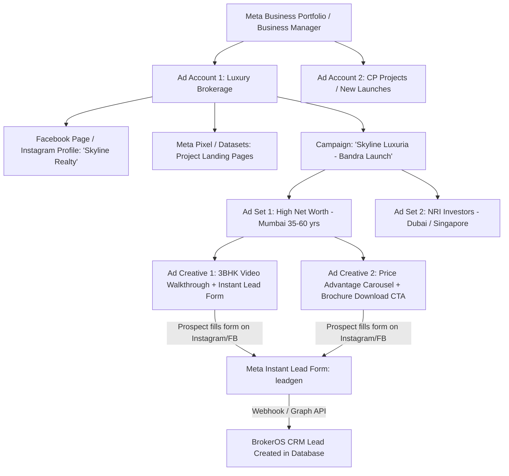

Here is the complete, exhaustive guide explaining **how Meta Ads (Facebook & Instagram) works**, how realtors and real estate brokerages use it in the real world, and **how we will architect, connect, fetch, and display Meta Ads data inside BrokerOS**.

---

## Part 1: How Meta Ads Works in Real Estate (The Real-World Model)

In real estate, brokerages and realtors run high-volume lead generation campaigns across Facebook and Instagram. Here is how Meta’s hierarchy maps to a brokerage:



### 1. The Meta Entity Hierarchy
1. **Meta Business Portfolio (Business Manager)**: The parent organization account.
2. **Ad Account (`act_XXXXXXXXX`)**: The financial container where ads run, budgets are billed, and campaigns live. A brokerage can have one or multiple Ad Accounts (e.g., one for direct sales, one for channel partner projects).
3. **Facebook Pages & Instagram Accounts**: The public brand identity under which ads appear. A realtor or brokerage often manages multiple project-specific Pages (e.g., *Skyline Realty*, *Green Valley Residences*).
4. **Campaign**: The top-level advertising goal. In real estate, the objective is almost always **`OUTCOME_LEADS`** (Lead Generation) or **`OUTCOME_TRAFFIC`** (Landing page visits).
5. **Ad Set**: Controls **Targeting** (location radius, age, net worth interests), **Placements** (Instagram Reels, Facebook Feed, Stories), **Daily/Lifetime Budget**, and **Bidding Strategy**.
6. **Ad & Ad Creative**: What the buyer actually sees on Instagram or Facebook. Contains:
   - Media (Image, Video, Carousel)
   - Primary Text / Description ("Luxury 3 & 4 BHK starting ₹2.5 Cr")
   - Headline ("Pre-Launch Discount Valid This Weekend")
   - Call-to-Action (CTA) Button ("Learn More", "Download Brochure", "Get Quote")
   - Destination (Instant Lead Form or Project Website URL)
7. **Meta Instant Forms (`leadgen`)**: In-app forms where Facebook/Instagram auto-fills the user's name, email, and phone number from their profile. **This is where 90%+ of real estate leads come from.**

---

## Part 2: How Users Connect Meta Ads to BrokerOS

Matching BrokerOS's existing integration architecture (like SendGrid, Twilio, Retell, Vapi), the connection is simple and clean.

### What the User Enters in the BrokerOS "Connect Meta Ads" Modal

```
┌──────────────────────────────────────────────────────────────┐
│  Connect Meta Ads (Facebook & Instagram)                     │
│  ──────────────────────────────────────────────────────────  │
│                                                              │
│  Account Name:       [ Skyline Realty Main Ad Account     ]  │
│                                                              │
│  Ad Account ID:      [ act_123456789012345                ]  │
│                      (Found in Meta Ads Manager URL)         │
│                                                              │
│  System User Token:  [ EAAxxxxxxxxxxxxxxxxxxxxxxxxxxxxx... ]  │
│                      (Never-expiring Permanent Access Token) │
│                                                              │
│  App ID (Optional):  [ 987654321098765                    ]  │
│  App Secret:         [ •••••••••••••••••••••••••••••••••• ]  │
│                      (Required for verifying Webhooks)       │
│                                                              │
│  [ Test Connection & Discover Pages ]   [ Save & Connect ]   │
└──────────────────────────────────────────────────────────────┘
```

### What Happens When They Click "Connect / Test":
1. BrokerOS calls Meta Graph API:
   ```http
   GET https://graph.facebook.com/v21.0/act_<AD_ACCOUNT_ID>?fields=id,name,account_status,currency,amount_spent,business_name&access_token=<TOKEN>
   ```
2. If token & account ID are valid:
   - Returns Account Name, Currency (INR/USD), Balance, and Active Status.
   - BrokerOS marks the integration as **`ACTIVE`**.
   - BrokerOS automatically queries all connected Facebook Pages under that account (`GET /me/accounts`).

---

## Part 3: Step-by-Step Meta Developer & Token Setup

To connect, the user needs a **Meta Developer App** and a **System User Access Token** (which **never expires**, so they don't have to log in every 60 days):

1. **Go to [developers.facebook.com](https://developers.facebook.com/)** and click **Create App**.
2. Select Use Case: **"Other"** → App Type: **"Business"**.
3. In the App Dashboard, add the **"Marketing API"** product.
4. **Generate Permanent Access Token in Business Manager**:
   - Go to **Meta Business Settings** (`business.facebook.com/settings`) → **Users** → **System Users**.
   - Click **Add System User** (Role: Admin).
   - Click **Add Assets** → Assign your **Ad Account** and **Facebook Pages** with Full Control.
   - Click **Generate New Token** and select the following permissions:
     - `ads_read` *(Read all campaigns, ad sets, ads, spend, impressions)*
     - `ads_management` *(Read campaign details, creatives, and status)*
     - `leads_retrieval` *(Fetch lead form submissions and buyer phone numbers)*
     - `pages_read_engagement` *(Read Facebook Page activity)*
     - `pages_show_list` *(List all Facebook pages under the business)*
     - `pages_manage_ads` *(Connect Page ads to lead forms)*
5. Copy the generated token and paste it into BrokerOS!

---

## Part 4: What Meta Ads API Provides (What We Fetch & Display)

Since we are **Fetching & Reading** (not writing/creating ads), Meta Graph API provides rich, high-value data:

### 1. Ad Account Level
- Account Name & ID
- Account Status (`1 = ACTIVE`, `2 = DISABLED`, `3 = UNSETTLED`)
- Currency (e.g. `INR`, `USD`)
- Total Amount Spent to Date
- Spend Cap / Balance

### 2. Campaign Level (`GET /act_<ID>/campaigns`)
- **Campaign Name & ID** (e.g., *"Skyline Oasis - 2BHK Pre-Launch"*)
- **Objective** (`OUTCOME_LEADS`, `OUTCOME_TRAFFIC`, `OUTCOME_AWARENESS`, `OUTCOME_SALES`)
- **Status** (`ACTIVE`, `PAUSED`, `ARCHIVED`)
- **Budget** (Daily Budget or Lifetime Budget in ₹ / $)
- **Start Time & Stop Time**
- **Performance Insights**:
  - Total Spend (₹)
  - Total Impressions (Views)
  - Reach (Unique people)
  - Clicks & Unique Link Clicks
  - Click-Through Rate (CTR %)
  - Cost Per Click (CPC)
  - Cost Per 1,000 Impressions (CPM)
  - Total Leads Generated
  - **Cost Per Lead (CPL)** (e.g., ₹280 / lead)

### 3. Ad Set Level (`GET /<CAMPAIGN_ID>/adsets`)
- **Ad Set Name & ID**
- **Targeting Profile**:
  - Geo Locations (e.g., *Mumbai, Pune, 25km radius*)
  - Age Range (e.g., *28 - 55*)
  - Genders (*All / Male / Female*)
  - Detailed Interests (e.g., *Real estate investment, Luxury lifestyle, HDFC Home Loans*)
- **Placements** (Facebook Feed, Instagram Feed, Instagram Reels, Audience Network)
- **Bid Strategy** (`LOWEST_COST_WITHOUT_CAP`, `COST_CAP`)

### 4. Ad Creative & Content Level (`GET /<ADSET_ID>/ads?fields=creative{...}`)
- **Creative Headline / Title** (e.g., *"Exclusive 3 BHK with Private Deck"*)
- **Body Copy / Primary Text** (e.g., *"Experience luxury living near BKC. Book with 10:90 payment plan..."*)
- **Media Preview**: Image URL, Video Thumbnail URL, or Carousel Cards
- **Call to Action (CTA)** (`LEARN_MORE`, `SIGN_UP`, `DOWNLOAD`, `GET_QUOTE`, `APPLY_NOW`)
- **Ad Preview URL**: Interactive iframe/link to preview the ad live as seen on Instagram/Facebook.

### 5. Instant Leads Stream (`leadgen` Webhook + API)
When a buyer fills out the ad form on Instagram or Facebook:
- Meta sends a webhook event with `leadgen_id`.
- BrokerOS fetches the lead details:
  - Full Name (`Rahul Sharma`)
  - Phone Number (`+91 98765 43210`)
  - Email (`rahul@gmail.com`)
  - City / Budget / Custom questions (e.g., *"Looking for: 3 BHK"*)
  - Associated Campaign Name, Ad Set Name, and Ad Creative Name.
- **BrokerOS automatically inserts this as a `Lead` in our database with `source: MARKETING_CAMPAIGN` / `FACEBOOK_ADS`**, assigned to the project!

---

## Part 5: UI & Dashboard Navigation in BrokerOS

### 1. New Navigation Route: `/dashboard/marketing/ads/meta`
Under **Marketing** in the sidebar:
- **Email Campaigns** (`/dashboard/marketing/email`)
- **SMS Campaigns** (`/dashboard/marketing/sms`)
- **Voice AI Campaigns** (`/dashboard/marketing/voice`)
- **Meta Ads (FB & IG)** (`/dashboard/marketing/ads/meta`) *(NEW)*
- **Google Ads** (`/dashboard/marketing/ads/google`) *(Future)*

### 2. The 3 Core Screens

#### Screen 1: Meta Ads Overview & Campaigns Table (`/dashboard/marketing/ads/meta`)
- **Top KPI Cards**:
  - Total Ad Spend across all campaigns
  - Total Leads Acquired (with % change)
  - Average Cost Per Lead (CPL)
  - Total Impressions & Average CTR
- **Active Connected Ad Accounts Selector** (switch between accounts or pages).
- **Campaigns Table**:
  - Campaign Name, Objective badge, Status badge (`ACTIVE` green, `PAUSED` gray)
  - Daily Budget
  - Leads Count
  - Cost Per Lead (₹)
  - Total Spend
  - Impressions & CTR
  - Actions: **View Analytics & Creatives** button

#### Screen 2: Campaign Detail & Creative Inspection (`/dashboard/marketing/ads/meta/campaigns/[id]`)
- **Campaign Performance Funnel**: Impressions → Clicks → Form Opens → Leads Submitted.
- **Ad Set Breakdown**: Compare performance between different target audiences.
- **Visual Ad Creatives Gallery**: Cards showing the actual ad image/video, headline, primary copy, and CTA button.
- **Acquired Leads Table**: Direct table of all real leads generated by this specific campaign with phone number, status in CRM, assigned sales executive, and date.

#### Screen 3: Settings & Accounts Management (`/dashboard/marketing/ads/settings`)
- List of connected Meta Ad Accounts.
- "Connect New Ad Account" modal with token & account ID validation.
- Webhook subscription status for real-time lead sync.

---

## Part 6: How This Fits Into Our Clean Architecture

| Monorepo Layer | Path | Responsibility |
|---|---|---|
| **Types** | [`packages/types/src/ads/meta.ts`](file:///c:/Users/Sumama/Desktop/enterprise-crm-realtors/packages/types/src/index.ts) | `MetaAdAccount`, `MetaCampaign`, `MetaAdSet`, `MetaAdCreative`, `MetaInsightMetric`, `IMetaAdsProvider` |
| **Constants** | [`packages/constants/src/ads/meta.ts`](file:///c:/Users/Sumama/Desktop/enterprise-crm-realtors/packages/constants/src/index.ts) | Objectives, status colors, permissions catalog, API version `v21.0` |
| **Prisma Schema** | [`packages/prisma/schema.prisma`](file:///c:/Users/Sumama/Desktop/enterprise-crm-realtors/packages/prisma/schema.prisma) | `MetaIntegration`, `MetaCampaignCache`, `MetaAdLeadLog` |
| **Integrations** | [`integrations/ads/meta/`](file:///c:/Users/Sumama/Desktop/enterprise-crm-realtors/integrations/README.md) | Decoupled `MetaGraphApiClient` (Account, Campaigns, AdSets, Creatives, Insights, Webhooks) |
| **Backend API** | [`apps/api/src/marketing/ads/meta/`](file:///c:/Users/Sumama/Desktop/enterprise-crm-realtors/apps/api/src/marketing/marketing.module.ts) | `MetaAdsController`, `MetaAdsService`, `MetaWebhooksController` |
| **Web Frontend** | [`apps/web/features/marketing/ads/meta/`](file:///c:/Users/Sumama/Desktop/enterprise-crm-realtors/apps/web/features/marketing/types.ts) | `MetaCampaignTable`, `MetaCreativeGallery`, `MetaConnectModal`, `MetaCampaignDetail` |

---

## Summary & Next Step

1. **No ad creation is needed** — Meta's native Ads Manager handles creation; BrokerOS acts as the **intelligent real estate command center** that pulls campaigns, ad sets, creatives, budgets, spend, and instantly captures every lead into the CRM.
2. **Connecting is effortless** — The user only inputs their **Ad Account ID** and **Permanent System User Access Token** (plus App Secret for webhooks).
3. **Multi-Account & Multi-Page Ready** — A single broker or agency can connect multiple Ad Accounts and view project-wise campaigns.

Let me know if you would like to proceed with writing the shared types, database models, integration adapter, backend API, and web UI!