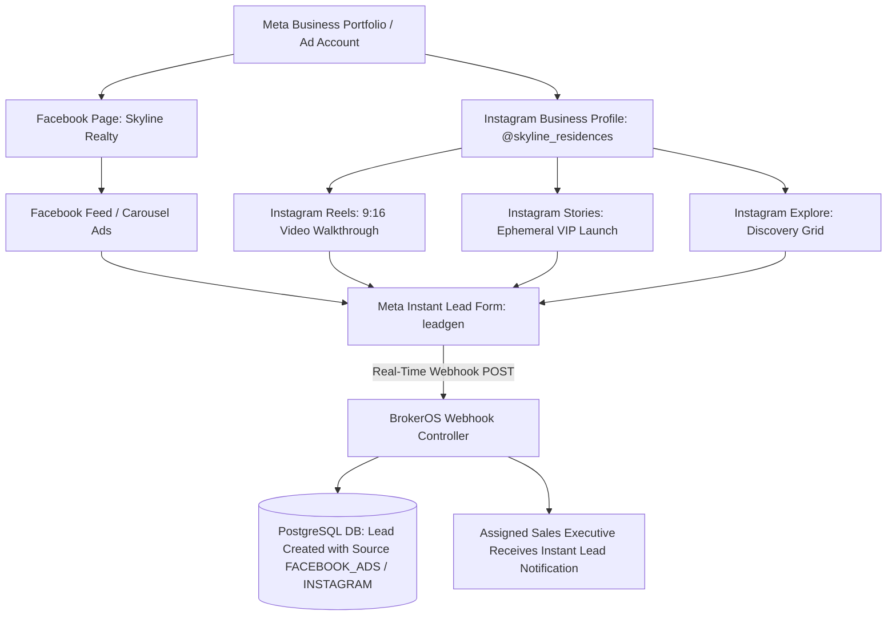
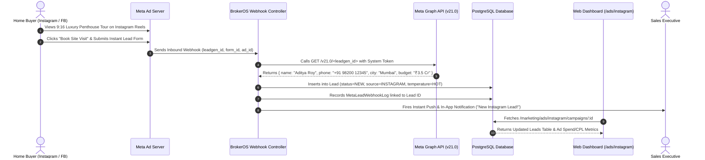

# 📱 BrokerOS — Meta & Instagram Ads Integration Architecture Guide

> **Authoritative Technical & Operational Guide** explaining how Meta Ads (Facebook & Instagram) work in real estate, how they are integrated into BrokerOS, and how the **Meta (Facebook) Ads Engine** and **Dedicated Instagram Ads Suite** are architected across shared packages, database models, backend APIs, and frontend web dashboards.

---

## Table of Contents

1. [Executive Summary & Real-World Real Estate Ad Model](#1-executive-summary--real-world-real-estate-ad-model)
2. [Dual-Engine Architectural Overview](#2-dual-engine-architectural-overview)
3. [The Meta & Instagram Entity Hierarchy](#3-the-meta--instagram-entity-hierarchy)
4. [Authentication & Permanent System User Token Setup](#4-authentication--permanent-system-user-token-setup)
5. [Shared Packages Architecture (`packages/`)](#5-shared-packages-architecture-packages)
   - 5.1 [Meta & Instagram Types (`@brokeros/types`)](#51-meta--instagram-types-brokerostypes)
   - 5.2 [Meta & Instagram Constants & Catalogs (`@brokeros/constants`)](#52-meta--instagram-constants--catalogs-brokerosconstants)
6. [Data & Database Layer (`packages/prisma/schema.prisma`)](#6-data--database-layer-packagesprismaschemaprisma)
7. [Integrations Layer (`integrations/ads/meta/`)](#7-integrations-layer-integrationsadsmeta)
8. [Backend API Architecture (`apps/api/src/marketing/ads/`)](#8-backend-api-architecture-appsapisrcmarketingads)
   - 8.1 [Meta (Facebook) Ads Module (`meta/`)](#81-meta-facebook-ads-module-meta)
   - 8.2 [Dedicated Instagram Ads Module (`instagram/`)](#82-dedicated-instagram-ads-module-instagram)
   - 8.3 [Real-Time Lead Webhook Handshake & Auto-Creation](#83-real-time-lead-webhook-handshake--auto-creation)
9. [Frontend Web Architecture & Dashboards (`apps/web/`)](#9-frontend-web-architecture--dashboards-appsweb)
   - 9.1 [Central Advertising Command Center (`/dashboard/marketing/ads`)](#91-central-advertising-command-center-dashboardmarketingads)
   - 9.2 [Meta (Facebook) Ads Engine (`/dashboard/marketing/ads/meta`)](#92-meta-facebook-ads-engine-dashboardmarketingadsmeta)
   - 9.3 [Dedicated Instagram Ads Suite (`/dashboard/marketing/ads/instagram`)](#93-dedicated-instagram-ads-suite-dashboardmarketingadsinstagram)
   - 9.4 [Realistic 9:16 Phone-Frame Creative Gallery (`InstagramCreativeGallery`)](#94-realistic-916-phone-frame-creative-gallery-instagramcreativegallery)
10. [End-to-End Data & Lead Acquisition Flow](#10-end-to-end-data--lead-acquisition-flow)
11. [Complete File-by-File Monorepo Inventory](#11-complete-file-by-file-monorepo-inventory)

---

## 1. Executive Summary & Real-World Real Estate Ad Model

In real estate, high-velocity lead acquisition is driven almost exclusively by digital ads on **Facebook** and **Instagram**. Real estate brokerages, sourcing managers, and marketing directors spend substantial budgets running targeted campaigns to capture high-intent buyers and NRI investors.



### Core Brokerage Use Cases
1. **New Project Launches**: High-impact 9:16 vertical video walkthroughs on Instagram Reels and Stories targeting high-net-worth individuals in specific pincodes or NRI hubs (Dubai, Singapore, London).
2. **Instant Lead Capture (`leadgen`)**: In-app native lead forms pre-filled by Meta with the prospect's verified full name, phone number, and email. Over 90% of real estate inquiries originate from these instant forms.
3. **Instagram DM Automation**: "Send Message" CTAs on Instagram feed/story ads initiating automated conversation funnels.
4. **Performance Attribution & Cost Control**: Tracking spend, impressions, CTR, total leads acquired, and real-time **Cost Per Lead (CPL)** directly inside the CRM without requiring executives to log into Meta Ads Manager.

---

## 2. Dual-Engine Architectural Overview

BrokerOS organizes digital advertising into a clean, hierarchical command structure:

```
                               ┌──────────────────────────────────────────────────────────┐
                               │             Advertising Command Center                   │
                               │             /dashboard/marketing/ads                     │
                               │   (Blended Spend, Combined Leads, Cross-Platform Feed)   │
                               └────────────────────────────┬─────────────────────────────┘
                                                            │
                            ┌───────────────────────────────┴───────────────────────────────┐
                            ▼                                                               ▼
┌────────────────────────────────────────────────────────┐      ┌────────────────────────────────────────────────────────┐
│               Meta (Facebook) Ads Engine               │      │             Instagram Ads Dedicated Suite              │
│               /dashboard/marketing/ads/meta            │      │             /dashboard/marketing/ads/instagram         │
│  - Desktop & Mobile Feed Ads                           │      │  - 9:16 Vertical Reels & Stories Walkthroughs          │
│  - Multi-Card Carousels & Price Advantage Banners      │      │  - 4-Way Placement Breakdown (Reels/Story/Feed/Explore)│
│  - Target Audience Breakdown                           │      │  - Phone-Frame Chassis Creative Gallery                │
│  - Direct Acquired Leads Table                         │      │  - Instagram DM & Instant Form Lead Attribution        │
└────────────────────────────────────────────────────────┘      └────────────────────────────────────────────────────────┘
```

---

## 3. The Meta & Instagram Entity Hierarchy

1. **Meta Business Portfolio (Business Manager)**: The parent organizational container.
2. **Ad Account (`act_XXXXXXXXX`)**: The financial container where ad spend is billed, campaigns are executed, and pixel datasets reside.
3. **Facebook Pages & Instagram Accounts**: The public brand identities where ads appear (e.g., *Skyline Realty*, `@skyline_residences`).
4. **Campaign**: The primary advertising objective (in real estate: `OUTCOME_LEADS` or `OUTCOME_TRAFFIC`).
5. **Ad Set**: Configures audience targeting (radius, age, income interests), placements, and daily budgets.
6. **Ad & Ad Creative**: The media (9:16 video, 1:1 image, carousel), primary copy, headline, and CTA button (`LEARN_MORE`, `GET_QUOTE`, `BOOK_NOW`, `SEND_INSTAGRAM_MESSAGE`).
7. **Instant Forms (`leadgen`)**: Native forms submitted directly within the Instagram/Facebook mobile apps.

---

## 4. Authentication & Permanent System User Token Setup

BrokerOS integrates via the **Meta Graph API (v21.0)** using a **Permanent System User Access Token** that never expires, eliminating the need to re-authenticate every 60 days.

```
┌──────────────────────────────────────────────────────────────┐
│  Connect Meta & Instagram Ads                                │
│  ──────────────────────────────────────────────────────────  │
│                                                              │
│  Account Name:       [ Skyline Realty Main Ad Account     ]  │
│                                                              │
│  Ad Account ID:      [ act_123456789012345                ]  │
│                      (Found in Meta Ads Manager URL)         │
│                                                              │
│  System User Token:  [ EAAxxxxxxxxxxxxxxxxxxxxxxxxxxxxx... ]  │
│                      (Never-expiring Permanent Access Token) │
│                                                              │
│  App ID (Optional):  [ 987654321098765                    ]  │
│  App Secret:         [ •••••••••••••••••••••••••••••••••• ]  │
│                      (Required for verifying Webhook SHA)    │
│                                                              │
│  [ Test Connection & Discover Pages ]   [ Save & Connect ]   │
└──────────────────────────────────────────────────────────────┘
```

### Required Meta Developer App Permissions
When generating the System User Token in Meta Business Manager (`business.facebook.com/settings` → *System Users*), the following permissions are granted:
- `ads_read`: Read campaigns, ad sets, ads, spend, impressions, CTR, and CPL metrics.
- `ads_management`: Read campaign status, budgets, and creative details.
- `leads_retrieval`: Real-time extraction of buyer phone numbers and emails from instant forms.
- `pages_read_engagement`: Read connected Facebook Page engagements and ads.
- `pages_show_list`: Discover all connected Pages and Instagram accounts.
- `pages_manage_ads`: Associate Instant Forms with active ad campaigns.

---

## 5. Shared Packages Architecture (`packages/`)

### 5.1 Meta & Instagram Types (`@brokeros/types`)

Located in [`packages/types/src/ads/`](file:///c:/Users/Sumama/Desktop/enterprise-crm-realtors/packages/types/src/ads/index.ts):

#### 1. Meta Types ([`packages/types/src/ads/meta.ts`](file:///c:/Users/Sumama/Desktop/enterprise-crm-realtors/packages/types/src/ads/meta.ts))
- `MetaCampaignStatus`: `'ACTIVE' | 'PAUSED' | 'ARCHIVED' | 'DELETED'`
- `MetaObjective`: `'OUTCOME_LEADS' | 'OUTCOME_TRAFFIC' | 'OUTCOME_AWARENESS' | 'OUTCOME_SALES'`
- `MetaAdAccount`: Ad account details, currency, spend cap, timezone, active status.
- `MetaCampaign`: Campaign ID, name, objective, status, daily/lifetime budgets, spend, leads count, CPL.
- `MetaAdSet`: Target audience location, age range, interests, bid strategy.
- `MetaAdCreative`: Headline, body text, image URL, thumbnail URL, CTA type, preview link.
- `MetaInsightMetrics`: Spend, impressions, reach, clicks, CPC, CPM, CTR, leads.
- `MetaLeadgenWebhookPayload`: Structure of incoming webhook payload containing `leadgen_id`, `form_id`, `ad_id`, `page_id`.

#### 2. Instagram Types ([`packages/types/src/ads/instagram.ts`](file:///c:/Users/Sumama/Desktop/enterprise-crm-realtors/packages/types/src/ads/instagram.ts))
- `InstagramPlacementType`: `'REELS' | 'STORY' | 'FEED' | 'EXPLORE'`
- `InstagramPlacementMetrics`: Placement-specific spend, impressions, reach, clicks, leads, CPL, CTR, video views, swipe-ups.
- `InstagramPlacementBreakdown`:
  ```typescript
  export interface InstagramPlacementBreakdown {
    reels: InstagramPlacementMetrics;
    stories: InstagramPlacementMetrics;
    feed: InstagramPlacementMetrics;
    explore: InstagramPlacementMetrics;
  }
  ```
- `InstagramCreativeData`: Extends `MetaAdCreative` with `aspectRatio: '9:16' | '1:1' | '4:5' | '16:9'`, `mediaType: 'VIDEO' | 'IMAGE' | 'CAROUSEL'`, `instagramActorHandle`, `caption`, `ctaText`.
- `InstagramCampaignSummaryKpis`: Aggregated metrics including `reelsViews`, `storySwipeUps`, `avgCpl`, `avgCtr`.
- `InstagramCampaignOverviewItem`: Comprehensive campaign object with placement array and attached creatives.

---

### 5.2 Meta & Instagram Constants & Catalogs (`@brokeros/constants`)

Located in [`packages/constants/src/ads/`](file:///c:/Users/Sumama/Desktop/enterprise-crm-realtors/packages/constants/src/ads/index.ts):

#### 1. Meta Constants ([`packages/constants/src/ads/meta.ts`](file:///c:/Users/Sumama/Desktop/enterprise-crm-realtors/packages/constants/src/ads/meta.ts))
- `META_GRAPH_API_VERSION`: `'v21.0'`
- `META_OBJECTIVES_CONFIG`: Human-readable labels, descriptions, and icon colors.
- `META_REQUIRED_PERMISSIONS`: Full catalog of OAuth permission scopes.

#### 2. Instagram Constants ([`packages/constants/src/ads/instagram.ts`](file:///c:/Users/Sumama/Desktop/enterprise-crm-realtors/packages/constants/src/ads/instagram.ts))
- `INSTAGRAM_BRAND_GRADIENT`: Signature 45° purple-pink-orange gradient.
- `INSTAGRAM_BRAND_COLORS`: Purple (`#833AB4`), Red (`#FD1D1D`), Orange (`#FCB045`), Pink (`#E1306C`).
- `INSTAGRAM_PLACEMENT_CONFIG`:
  - `REELS`: 9:16 Fullscreen Video Walkthroughs.
  - `STORY`: 9:16 Ephemeral VIP launch cards & price drops.
  - `FEED`: 1:1 & 4:5 Architectural renders and carousels.
  - `EXPLORE`: Discovery grid ads for home-seekers.
- `INSTAGRAM_CTA_CONFIG`:
  - `SEND_INSTAGRAM_MESSAGE`: Opens direct Instagram DM conversation.
  - `LEARN_MORE`: Opens Instant Lead Form or property landing page.
  - `GET_QUOTE`: Requests custom unit pricing calculation.
  - `BOOK_NOW`: Schedules direct site visit appointment.
  - `WATCH_MORE`: Expands 4K penthouse walkthrough video.

---

## 6. Data & Database Layer (`packages/prisma/schema.prisma`)

Three dedicated database models in [`packages/prisma/schema.prisma`](file:///c:/Users/Sumama/Desktop/enterprise-crm-realtors/packages/prisma/schema.prisma) power the advertising subsystem:

```prisma
model MetaAdIntegration {
  id          String   @id @default(uuid())
  name        String
  adAccountId String   // e.g. "act_1234567890"
  accessToken String   @db.Text
  appId       String?
  appSecret   String?
  currency    String   @default("INR")
  timezone    String   @default("Asia/Kolkata")
  isActive    Boolean  @default(true)
  isDefault   Boolean  @default(false)
  lastSyncedAt DateTime?
  createdAt   DateTime @default(now())
  updatedAt   DateTime @updatedAt

  campaigns   MetaCampaignCache[]
  webhookLogs MetaLeadWebhookLog[]

  @@index([adAccountId])
  @@index([isActive])
  @@map("meta_ad_integration")
}

model MetaCampaignCache {
  id              String             @id // Meta Campaign ID
  integrationId   String
  integration     MetaAdIntegration  @relation(fields: [integrationId], references: [id], onDelete: Cascade)
  name            String
  status          String             // "ACTIVE", "PAUSED", "ARCHIVED"
  effectiveStatus String?
  objective       String             // "OUTCOME_LEADS", "OUTCOME_TRAFFIC"
  dailyBudget     Float?
  lifetimeBudget  Float?
  spend           Float              @default(0)
  impressions     Int                @default(0)
  reach           Int                @default(0)
  clicks          Int                @default(0)
  cpc             Float              @default(0)
  cpm             Float              @default(0)
  ctr             Float              @default(0)
  leadsCount      Int                @default(0)
  costPerLead     Float              @default(0)
  adSetsData      Json?              // Cached ad sets & targeting parameters
  creativesData   Json?              // Cached creatives (images, videos, headlines, copy, CTAs)
  startTime       DateTime?
  stopTime        DateTime?
  lastSyncedAt    DateTime           @default(now())
  createdAt       DateTime           @default(now())
  updatedAt       DateTime           @updatedAt

  @@index([integrationId, status])
  @@index([status])
  @@map("meta_campaign_cache")
}

model MetaLeadWebhookLog {
  id            String             @id @default(uuid())
  integrationId String?
  integration   MetaAdIntegration? @relation(fields: [integrationId], references: [id], onDelete: SetNull)
  leadgenId     String             @unique // Meta Leadgen ID
  formId        String?
  adId          String?
  adsetId       String?
  campaignId    String?
  pageId        String?
  rawPayload    Json
  leadId        String?            // Linked CRM Lead record ID
  lead          Lead?              @relation(fields: [leadId], references: [id], onDelete: SetNull)
  processed     Boolean            @default(false)
  createdAt     DateTime           @default(now())

  @@index([leadgenId])
  @@index([campaignId])
  @@index([formId])
  @@map("meta_lead_webhook_log")
}
```

---

## 7. Integrations Layer (`integrations/ads/meta/`)

The decoupled Meta client lives in [`integrations/ads/meta/src/client.ts`](file:///c:/Users/Sumama/Desktop/enterprise-crm-realtors/integrations/ads/meta/src/client.ts):

- **`validateAccount()`**: Pings `GET /v21.0/act_<ID>?fields=id,name,account_status,currency,amount_spent,business_name` to ensure tokens are valid.
- **`getCampaigns(datePreset)`**: Fetches all campaigns with spend, impressions, clicks, CTR, and lead counts.
- **`getAdSets(campaignId)`**: Retrieves targeting parameters (locations, age limits, interests) and placement positions.
- **`getAdCreatives(adSetId)`**: Extracts media URLs, headlines, body copy, and CTA buttons.
- **`getLeadDetails(leadgenId)`**: Fetches form field data (Full Name, Phone Number, Email, City, Budget) when a prospect submits an ad form.

---

## 8. Backend API Architecture (`apps/api/src/marketing/ads/`)

```
apps/api/src/marketing/ads/
├── meta/
│   ├── controllers/
│   │   ├── meta-ads.controller.ts      # GET /campaigns, GET /campaigns/:id, POST /sync, GET /integrations
│   │   └── meta-webhooks.controller.ts # GET/POST /marketing/ads/meta/webhooks (hub.challenge + leadgen handler)
│   ├── services/
│   │   ├── meta-ads.service.ts         # Facade coordinator
│   │   ├── meta-sync.service.ts        # Graph API data sync & database caching
│   │   └── meta-integrations.service.ts# Credential management & validation
│   └── dto/
│       └── meta-ads.dto.ts             # ConnectMetaIntegrationDto, SyncMetaCampaignsDto
│
└── instagram/
    ├── controllers/
    │   └── instagram-ads.controller.ts # GET /overview, GET /campaigns, GET /campaigns/:id, POST /sync
    ├── services/
    │   └── instagram-ads.service.ts    # Placement extraction, 4-way breakdown calculator, vertical creative mapper
    └── dto/
        └── instagram-ads.dto.ts        # SyncInstagramCampaignsDto
```

---

### 8.1 Meta (Facebook) Ads Module (`meta/`)

- `GET /api/marketing/ads/meta/campaigns`: Returns all active Meta campaigns with aggregate spend and CPL KPIs.
- `GET /api/marketing/ads/meta/campaigns/:id`: Returns full campaign inspection (ad sets, visual creatives, and acquired CRM leads).
- `POST /api/marketing/ads/meta/integrations`: Connects a new Meta Ad Account with live token verification.
- `POST /api/marketing/ads/meta/integrations/:id/sync`: Triggers an on-demand live synchronization from the Meta Graph API.

---

### 8.2 Dedicated Instagram Ads Module (`instagram/`)

Located at [`apps/api/src/marketing/ads/instagram/`](file:///c:/Users/Sumama/Desktop/enterprise-crm-realtors/apps/api/src/marketing/ads/instagram/controllers/instagram-ads.controller.ts):

- `GET /api/marketing/ads/instagram/overview`:
  - Computes the **4-Way Placement Performance Breakdown** (Reels, Stories, Feed, Explore).
  - Calculates Instagram-specific KPIs (`reelsViews`, `storySwipeUps`, `avgCpl`, `avgCtr`).
  - Formats campaign objects with detected Instagram placements.
- `GET /api/marketing/ads/instagram/campaigns/:id`:
  - Formats **9:16 vertical video & Story creative cards** with real estate walkthrough descriptions and Instagram handles (`@godrejproperties_luxury`).
  - Returns acquired CRM leads with direct phone numbers, lead temperatures (`HOT`, `WARM`), budget, and assigned sales executive.
- `POST /api/marketing/ads/instagram/sync`: Triggers live synchronization for the active Instagram account.

---

### 8.3 Real-Time Lead Webhook Handshake & Auto-Creation

Located at [`apps/api/src/marketing/ads/meta/controllers/meta-webhooks.controller.ts`](file:///c:/Users/Sumama/Desktop/enterprise-crm-realtors/apps/api/src/marketing/marketing.module.ts):

1. **Webhook Handshake (`GET`)**: Validates `hub.verify_token` against the configured secret and responds with `hub.challenge`.
2. **Event Ingestion (`POST`)**:
   - Parses incoming `leadgen` event containing `leadgen_id`.
   - Calls `MetaGraphApiClient.getLeadDetails(leadgen_id)`.
   - Extracts `full_name`, `phone_number`, `email`, `city`, `budget`.
   - Automatically executes a transactional insert into the CRM `Lead` table:
     ```typescript
     await prisma.lead.create({
       data: {
         firstName: nameParts[0],
         lastName: nameParts.slice(1).join(' '),
         phone: phoneNumber,
         email: emailAddress,
         source: 'FACEBOOK_ADS', // or 'INSTAGRAM'
         temperature: 'HOT',     // Immediate high intent
         preferredLocation: city,
         budget: parsedBudget,
         status: 'NEW',
       },
     });
     ```
   - Logs the transaction in `MetaLeadWebhookLog` and fires a WebSocket alert to the assigned sales manager.

---

## 9. Frontend Web Architecture & Dashboards (`apps/web/`)

### 9.1 Central Advertising Command Center (`/dashboard/marketing/ads`)

Located at [`apps/web/app/dashboard/marketing/ads/page.tsx`](file:///c:/Users/Sumama/Desktop/enterprise-crm-realtors/apps/web/app/dashboard/marketing/ads/page.tsx):

- **Blended Cross-Platform KPI Cards**: Total Digital Ad Spend, Total CRM Leads Acquired, Blended Cost Per Lead, and Total Brand Impressions across both Facebook & Instagram.
- **Interactive Multi-Platform Launchpad**:
  - **Meta (Facebook) Ads Engine Card**: Feed, Carousels, Instant Forms, and Messenger ads.
  - **Instagram Ads Dedicated Suite Card**: 9:16 vertical Reels & Stories, Explore discovery grid, and DM capture.
- **Unified Cross-Platform Campaigns Feed**: Filterable master table showing all active campaigns across both engines with platform attribution badges and direct inspection links.

---

### 9.2 Meta (Facebook) Ads Engine (`/dashboard/marketing/ads/meta`)

Located at [`apps/web/app/dashboard/marketing/ads/meta/page.tsx`](file:///c:/Users/Sumama/Desktop/enterprise-crm-realtors/apps/web/app/dashboard/marketing/ads/meta/page.tsx):

- **Meta KPI Cards**: Spend, Leads, CPL, Impressions, and CTR.
- **Connected Ad Account Selector**: Switch between multiple ad accounts or project pages.
- **Campaigns Table View**: View budgets, spend, lead counts, and status toggles.
- **Campaign Inspection Route (`/campaigns/[id]`)**: Detailed funnel metrics, audience targeting breakdown, creative cards, and acquired lead records.
- **Settings Route (`/settings`)**: Manage access tokens, Ad Account IDs, and webhook secret verification.

---

### 9.3 Dedicated Instagram Ads Suite (`/dashboard/marketing/ads/instagram`)

Located at [`apps/web/app/dashboard/marketing/ads/instagram/page.tsx`](file:///c:/Users/Sumama/Desktop/enterprise-crm-realtors/apps/web/app/dashboard/marketing/ads/instagram/page.tsx):

- **Instagram KPI Cards (`InstagramKpiCards.tsx`)**: Highlights total spend, IG leads, average IG CPL, Reels video views, and Story swipe-ups.
- **Placement Performance Breakdown Widget (`InstagramPlacementBreakdown.tsx`)**:
  - **Reels (9:16 Video)**: Spend, leads count, video view completion count, and CPL.
  - **Stories (9:16 Ephemeral)**: Spend, leads count, swipe-up conversion rate, and CPL.
  - **Feed (1:1 Posts)**: Spend, high-res image engagement, and CPL.
  - **Explore (Grid)**: Discovery impressions and search-intent leads.
- **Instagram Campaign Table (`InstagramCampaignTable.tsx`)**: Displays campaigns with placement badges (`Reels`, `Story`, `Feed`, `Explore`) and direct inspection actions.
- **Instagram Campaign Inspection Route (`/campaigns/[id]`)**: Full campaign drill-down combining the 9:16 phone-frame creative gallery, ad set targeting inspector, and the real-time acquired CRM leads table.
- **Instagram Settings Route (`/settings`)**: Dedicated Instagram connection configuration.

---

### 9.4 Realistic 9:16 Phone-Frame Creative Gallery (`InstagramCreativeGallery`)

Located at [`apps/web/features/marketing/ads/instagram/components/InstagramCreativeGallery.tsx`](file:///c:/Users/Sumama/Desktop/enterprise-crm-realtors/apps/web/features/marketing/ads/instagram/components/InstagramCreativeGallery.tsx):

Renders pixel-perfect, interactive mobile chassis frames mirroring the exact Instagram mobile interface:

```
┌──────────────────────────────────────────────┐
│  (●) Speaker Notch                           │
│ ┌──────────────────────────────────────────┐ │
│ │ [IG] @godrejproperties_luxury  [⋮]       │ │
│ │ Sponsored                                │ │
│ │                                          │ │
│ │                                   [♥]2.4k│ │
│ │                                   [💬]184│ │
│ │              [ ▶ Play ]           [↗]    │ │
│ │                                   [🔖]   │ │
│ │                                          │ │
│ │ Ultra-luxury 3 & 4 BHK residences...     │ │
│ │ ┌──────────────────────────────────────┐ │ │
│ │ │             LEARN MORE               │ │ │
│ │ └──────────────────────────────────────┘ │ │
│ └──────────────────────────────────────────┘ │
└──────────────────────────────────────────────┘
```

- **Format Filter**: Toggle between `All Formats`, `9:16 Reels & Stories`, and `1:1 Feed Posts`.
- **Sponsored Profile Header**: Shows Instagram account handle with verified blue checkmark badge.
- **Reels Floating Actions**: Displays realistic Instagram interaction icons (Heart, Comment, Share, Bookmark).
- **Play Button Overlay**: Highlights video walkthrough media.
- **Gradient CTA Pill Button**: Displays call-to-action button (`LEARN MORE`, `GET QUOTE`, `BOOK SITE VISIT`) with Instagram's signature gradient.

---

## 10. End-to-End Data & Lead Acquisition Flow



---

## 11. Complete File-by-File Monorepo Inventory

| Monorepo Path | Layer | Responsibility |
|---|---|---|
| [`packages/types/src/ads/meta.ts`](file:///c:/Users/Sumama/Desktop/enterprise-crm-realtors/packages/types/src/ads/meta.ts) | Types | Meta Ad Account, Campaign, Ad Set, Creative & Webhook interfaces |
| [`packages/types/src/ads/instagram.ts`](file:///c:/Users/Sumama/Desktop/enterprise-crm-realtors/packages/types/src/ads/instagram.ts) | Types | Instagram placement metrics, 4-way breakdown, 9:16 creative types |
| [`packages/types/src/ads/index.ts`](file:///c:/Users/Sumama/Desktop/enterprise-crm-realtors/packages/types/src/ads/index.ts) | Types | Unified Ads Types barrel export |
| [`packages/constants/src/ads/meta.ts`](file:///c:/Users/Sumama/Desktop/enterprise-crm-realtors/packages/constants/src/ads/meta.ts) | Constants | Graph API version (`v21.0`), objectives, permissions catalog |
| [`packages/constants/src/ads/instagram.ts`](file:///c:/Users/Sumama/Desktop/enterprise-crm-realtors/packages/constants/src/ads/instagram.ts) | Constants | Brand gradients, placement configs (Reels/Stories), CTA dictionaries |
| [`packages/constants/src/ads/index.ts`](file:///c:/Users/Sumama/Desktop/enterprise-crm-realtors/packages/constants/src/ads/index.ts) | Constants | Unified Ads Constants barrel export |
| [`packages/prisma/schema.prisma`](file:///c:/Users/Sumama/Desktop/enterprise-crm-realtors/packages/prisma/schema.prisma) | Database | `MetaAdIntegration`, `MetaCampaignCache`, `MetaLeadWebhookLog` models |
| [`integrations/ads/meta/src/client.ts`](file:///c:/Users/Sumama/Desktop/enterprise-crm-realtors/integrations/ads/meta/src/client.ts) | Integrations | Decoupled `MetaGraphApiClient` (Account, Campaigns, Creatives, Leads) |
| [`apps/api/src/marketing/ads/meta/controllers/meta-ads.controller.ts`](file:///c:/Users/Sumama/Desktop/enterprise-crm-realtors/apps/api/src/marketing/marketing.module.ts) | API | Meta campaigns list, inspection, and live sync endpoints |
| [`apps/api/src/marketing/ads/meta/controllers/meta-webhooks.controller.ts`](file:///c:/Users/Sumama/Desktop/enterprise-crm-realtors/apps/api/src/marketing/marketing.module.ts) | API | Webhook handshake and automatic CRM `Lead` record generator |
| [`apps/api/src/marketing/ads/instagram/controllers/instagram-ads.controller.ts`](file:///c:/Users/Sumama/Desktop/enterprise-crm-realtors/apps/api/src/marketing/ads/instagram/controllers/instagram-ads.controller.ts) | API | Instagram overview, placement breakdowns, and campaign details |
| [`apps/api/src/marketing/ads/instagram/services/instagram-ads.service.ts`](file:///c:/Users/Sumama/Desktop/enterprise-crm-realtors/apps/api/src/marketing/ads/instagram/services/instagram-ads.service.ts) | API | Placement extraction, 4-way breakdown math, vertical creative formatting |
| [`apps/web/app/dashboard/marketing/ads/page.tsx`](file:///c:/Users/Sumama/Desktop/enterprise-crm-realtors/apps/web/app/dashboard/marketing/ads/page.tsx) | Web App | Master Advertising Command Center (Cross-Platform KPIs & Feed) |
| [`apps/web/app/dashboard/marketing/ads/meta/page.tsx`](file:///c:/Users/Sumama/Desktop/enterprise-crm-realtors/apps/web/app/dashboard/marketing/ads/meta/page.tsx) | Web App | Meta (Facebook) Ads Engine Overview & Campaigns Table |
| [`apps/web/app/dashboard/marketing/ads/meta/campaigns/[id]/page.tsx`](file:///c:/Users/Sumama/Desktop/enterprise-crm-realtors/apps/web/app/dashboard/marketing/ads/meta/campaigns/[id]/page.tsx) | Web App | Meta Campaign Detail, Ad Sets, Creatives & Leads Inspection |
| [`apps/web/app/dashboard/marketing/ads/meta/settings/page.tsx`](file:///c:/Users/Sumama/Desktop/enterprise-crm-realtors/apps/web/app/dashboard/marketing/ads/meta/settings/) | Web App | Meta Ad Accounts management & Token configuration |
| [`apps/web/app/dashboard/marketing/ads/instagram/page.tsx`](file:///c:/Users/Sumama/Desktop/enterprise-crm-realtors/apps/web/app/dashboard/marketing/ads/instagram/page.tsx) | Web App | Dedicated Instagram Ads Suite Overview & Placement Breakdown |
| [`apps/web/app/dashboard/marketing/ads/instagram/campaigns/[id]/page.tsx`](file:///c:/Users/Sumama/Desktop/enterprise-crm-realtors/apps/web/app/dashboard/marketing/ads/instagram/campaigns/[id]/page.tsx) | Web App | Instagram Campaign Detail, 9:16 Creatives Gallery & Acquired Leads |
| [`apps/web/app/dashboard/marketing/ads/instagram/settings/page.tsx`](file:///c:/Users/Sumama/Desktop/enterprise-crm-realtors/apps/web/app/dashboard/marketing/ads/instagram/settings/page.tsx) | Web App | Instagram Ad Accounts management & Token configuration |
| [`apps/web/features/marketing/ads/instagram/components/InstagramCreativeGallery.tsx`](file:///c:/Users/Sumama/Desktop/enterprise-crm-realtors/apps/web/features/marketing/ads/instagram/components/InstagramCreativeGallery.tsx) | Web UI | Phone-Frame chassis component with 9:16 Reels/Stories & CTA pills |
| [`apps/web/features/marketing/ads/instagram/components/InstagramPlacementBreakdown.tsx`](file:///c:/Users/Sumama/Desktop/enterprise-crm-realtors/apps/web/features/marketing/ads/instagram/components/InstagramPlacementBreakdown.tsx) | Web UI | 4-Way Placement breakdown widget (Reels vs Stories vs Feed vs Explore) |
| [`apps/web/features/marketing/ads/instagram/components/InstagramKpiCards.tsx`](file:///c:/Users/Sumama/Desktop/enterprise-crm-realtors/apps/web/features/marketing/ads/instagram/components/InstagramKpiCards.tsx) | Web UI | Instagram spend, leads, CPL, video views & swipe-ups KPI cards |
| [`apps/web/features/marketing/ads/instagram/components/InstagramCampaignTable.tsx`](file:///c:/Users/Sumama/Desktop/enterprise-crm-realtors/apps/web/features/marketing/ads/instagram/components/InstagramCampaignTable.tsx) | Web UI | Instagram campaigns list table with placement badges |
| [`apps/web/features/marketing/ads/instagram/components/InstagramAcquiredLeadsTable.tsx`](file:///c:/Users/Sumama/Desktop/enterprise-crm-realtors/apps/web/features/marketing/ads/instagram/components/InstagramAcquiredLeadsTable.tsx) | Web UI | Acquired Instagram leads table with direct CRM lead links |
| [`apps/web/features/marketing/ads/instagram/components/InstagramAdSetBreakdown.tsx`](file:///c:/Users/Sumama/Desktop/enterprise-crm-realtors/apps/web/features/marketing/ads/instagram/components/InstagramAdSetBreakdown.tsx) | Web UI | Targeting profile and audience demographic inspector |
| [`apps/web/features/marketing/ads/instagram/components/InstagramConnectModal.tsx`](file:///c:/Users/Sumama/Desktop/enterprise-crm-realtors/apps/web/features/marketing/ads/instagram/components/InstagramConnectModal.tsx) | Web UI | Quick connection modal for Instagram Ad Accounts |
| [`apps/web/components/ui/InstagramIcon.tsx`](file:///c:/Users/Sumama/Desktop/enterprise-crm-realtors/apps/web/components/ui/InstagramIcon.tsx) | Web UI | Branded vector SVG Instagram icon component |

---

## Summary

BrokerOS provides an end-to-end, enterprise-ready digital advertising platform:
1. **Master Advertising Command Center** (`/dashboard/marketing/ads`): Blended overview of digital marketing performance.
2. **Meta (Facebook) Ads Engine** (`/dashboard/marketing/ads/meta`): Desktop/Mobile feed ads, carousels, and instant forms.
3. **Dedicated Instagram Ads Suite** (`/dashboard/marketing/ads/instagram`): 9:16 vertical Reels & Stories walk-throughs, 4-way placement analytics (Reels, Stories, Feed, Explore), interactive phone-frame creative inspection, and instant CRM lead conversion.